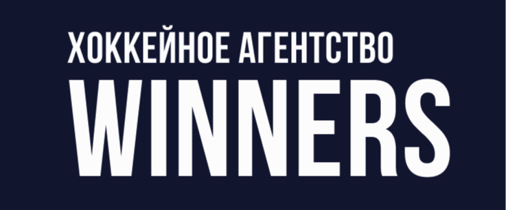

## Introduction

WINNERS Hockey Agency is a modern, cutting-edge website built for the professional hockey industry. This project represents a comprehensive digital platform that bridges the gap between hockey talent and professional opportunities. Developed with the latest web technologies, the site delivers a seamless user experience across all devices while maintaining high performance standards.

Built with Next.js and powered by a headless CMS architecture, the website exemplifies modern web development practices in the sports industry, combining aesthetic design with robust functionality.

# Table of Contents

1. [Features](#features)
2. [Stack](#stack)
3. [Architecture](#architecture)
4. [Credits](#credits)

## Features

- 🏒 **Hockey Player Profiles** - Comprehensive player database
- 📰 **News & Updates** - Latest hockey industry news and agency updates
- 👥 **Agency Team** - Comprehensive agency database
- 📝 **Player Registration** - Online application form for aspiring players
- 📱 **Responsive Design** - Optimized for all devices
- 🚀 **Performance Optimized** - Fast loading with Next.js and modern stack
- 🔍 **SEO Friendly** - Optimized for search engines
- 📊 **Analytics** - Integrated Yandex Metrics for insights

## Stack

| Frontend       | Backend  | Tools & Services |
| -------------- | -------- | ---------------- |
| Next.js        | Directus | Git              |
| TanStack Query | N8N      | ESLint           |
| TypeScript     |          | Prettier         |
| TailwindCSS    |          | Docker           |
| PostCSS        |          |                  |
| Radix UI       |          |                  |
| ShadcnUI       |          |                  |
| Embla Carousel |          |                  |
| Framer Motion  |          |                  |
| GSAP           |          |                  |
| Lucide         |          |                  |
| reCAPTCHA      |          |                  |
| Yandex Metrics |          |                  |

## Architecture

- **Frontend:** Built with Next.js 14 using the App Router for optimal performance and SEO
- **Backend:** Headless CMS powered by Directus for content management
- **Automation:** N8N workflows for automated processes and integrations
- **Deployment:** Containerized with Docker
- **State Management:** TanStack Query for efficient server state management
- **Styling:** TailwindCSS with custom design system and Radix UI primitives

## Credits

- **Developer:** [Daniel Abros](https://abros.dev)
- **Design:** -
- **Client:** [WINNERS Hockey Agency](https://wnrs.ru)
